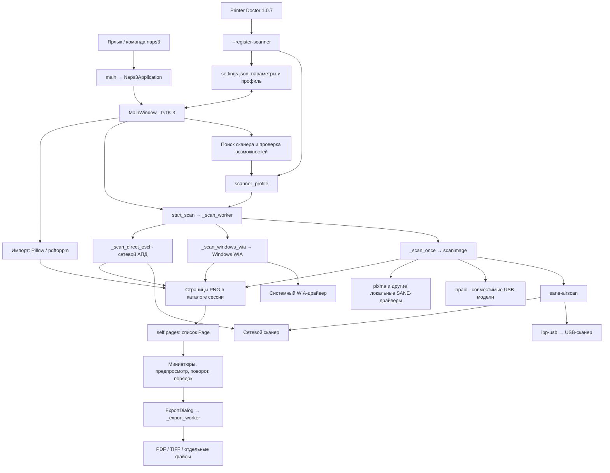
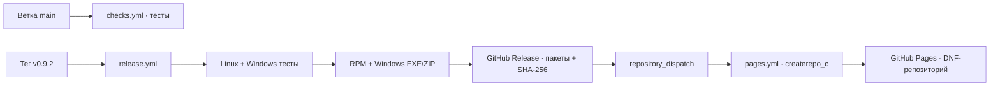
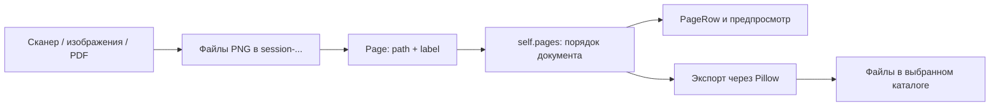

# Карта программы NAPS3

Карта текущего исходного кода версии **0.9.2** с поддержкой РЕД ОС и Windows, обновлена 11 сентября 2026 года. Источники: граф codebase-memory-mcp, реализации функций, тесты, установочные скрипты и конфигурации пакетов.

NAPS3 — настольное приложение для сканирования документов на РЕД ОС 8 и Windows 10/11. Пользователь подключает сканер, получает страницы со стекла или автоподатчика, меняет их порядок и ориентацию, затем сохраняет PDF, TIFF или отдельные файлы. Изображения и PDF также можно импортировать. Интерфейс и модель документа общие; меняется только системный backend сканера.

Основной интерфейс и сценарии сосредоточены в [naps3.py](naps3.py). Граница Windows вынесена в [windows_backend.py](windows_backend.py), а COM-вызовы WIA — в скомпилированный помощник из [windows/wia_bridge.cs](windows/wia_bridge.cs). Главный класс `MainWindow` объединяет интерфейс, управление операциями и обработку страниц.

## Общая схема

Стрелки показывают направление управления и передачи результатов. eSCL — протокол сканирования по HTTP; SANE — системная подсистема сканирования Linux; АПД — автоподатчик документов.



## Файлы проекта

| Файл или каталог | Назначение |
| --- | --- |
| [naps3.py](naps3.py) | Приложение: GTK, обнаружение WIA/SANE и сетевого eSCL через DNS-SD/mDNS, сканирование, страницы, импорт и экспорт. |
| [windows_backend.py](windows_backend.py) | Запуск WIA-моста, разбор JSON, профили Windows и поиск встроенных программ. |
| [windows/wia_bridge.cs](windows/wia_bridge.cs) | Нативный помощник без PowerShell: точный выбор WIA DeviceID, стекло/АПД/дуплекс и получение BMP через WIA COM. |
| [windows/build_wia_bridge.py](windows/build_wia_bridge.py) | Компиляция нативного WIA-помощника системным C#-компилятором Windows. |
| [windows/startup_hook.py](windows/startup_hook.py) | Ранний журнал запуска Windows и системное сообщение при необработанной ошибке до появления окна. |
| [windows/naps3-windows.spec](windows/naps3-windows.spec) | Состав переносимой сборки PyInstaller с GTK, Pillow, WIA-мостом и pdftoppm. |
| [windows/installer.nsi](windows/installer.nsi), [windows/build_installer.ps1](windows/build_installer.ps1) | Бесплатный пользовательский установщик NSIS, переносной ZIP и SHA-256. |
| [.github/workflows/windows.yml](.github/workflows/windows.yml) | Тесты и пробная сборка Windows в MSYS2 UCRT64. |
| [README.md](README.md) | Публичная страница проекта и команды установки из GitHub Release или DNF-репозитория. |
| [tests/test_naps3.py](tests/test_naps3.py) | 36 тестов: неблокирующий запуск Windows, строгий self-test, разбор eSCL/SANE и DNS-SD, поиск сетевых устройств и Canon pixma, сохранение точного eSCL URL без повторного поиска, ручной дуплекс, экспорт, отмена и работа со страницами. |
| [tests/test_scanner_recovery.py](tests/test_scanner_recovery.py) | 24 теста сохранения выбранного устройства, миграции старого профиля HP и фоновой проверки при запуске. |
| [tests/test_save_safety.py](tests/test_save_safety.py) | 30 тестов защиты файлов, блокировки редактирования, учёта несохранённых изменений и закрытия. |
| [tests/test_registration_cli.py](tests/test_registration_cli.py) | 5 тестов точной регистрации USB/сети, сохранения остальных настроек, атомарной записи, запрета root и блокировки открытого GUI. |
| `diagnostics/` | Локальные журналы, резервные копии и отчёты проверок. Каталог исключён из публичного Git-репозитория. |
| [tests/gtk_smoke.py](tests/gtk_smoke.py) | Проверка настоящего окна GTK с тестовыми страницами и отключённым поиском оборудования. |
| [packaging/naps3.spec](packaging/naps3.spec) | Состав RPM, системные зависимости, проверки сборки и действия при установке/удалении. |
| [packaging/naps3-launcher](packaging/naps3-launcher) | Запуск установленного приложения и запись ошибок в `startup.log`. |
| [packaging/ru.redos.NAPS3.desktop](packaging/ru.redos.NAPS3.desktop) | Ярлык приложения в системном меню. |
| [packaging/99-naps3-canon-mf4410.rules](packaging/99-naps3-canon-mf4410.rules) | Позднее правило доступа только к Canon MF4410 с USB ID `04a9:2737`. |
| [packaging/naps3-usb-permissions](packaging/naps3-usb-permissions) | Немедленно применяет правило к уже подключённому Canon, включая удалённые графические сессии. |
| [build_rpm.sh](build_rpm.sh) | Сборка RPM для x86_64, размещение результата и контрольной суммы в `dist/`. |
| [.github/workflows/checks.yml](.github/workflows/checks.yml) | Проверка синтаксиса, 92 модульных теста, GTK smoke-тест и проверка shell-скриптов при каждом обновлении `main`. |
| [.github/workflows/release.yml](.github/workflows/release.yml) | По тегу `v*` повторяет тесты, собирает RPM, создаёт GitHub Release и запускает публикацию DNF. |
| [.github/workflows/pages.yml](.github/workflows/pages.yml) | Создаёт метаданные DNF из последнего выпуска и публикует их через GitHub Pages. |
| [install_redos8.sh](install_redos8.sh) | Ручная установка в `/opt/naps3`, зависимости и настройка службы ipp-usb. |
| [update_naps3_app.sh](update_naps3_app.sh) | Обновление `naps3.py` в RPM- или ручной установке с резервной копией. |
| [uninstall.sh](uninstall.sh) | Удаление ручной установки; при установленном RPM направляет к `dnf remove`. |
| [ipp-usb-naps3](ipp-usb-naps3) | Поставляемый исполняемый файл USB-транспорта. Его исходников в этой папке нет. |
| [ipp-usb.conf](ipp-usb.conf) | Локальные HTTP-порты ipp-usb, отключение DNS-SD и настройки журналирования. |
| [ipp-usb-m428.conf](ipp-usb-m428.conf) | Параметр `zlp-recv-hack` для USB VID:PID `03f0:c32a`. |
| [ipp-usb-naps3.service.conf](ipp-usb-naps3.service.conf) | Подключение поставляемого ipp-usb к systemd при ручной установке. |
| [packaging/ipp-usb-naps3-rpm.service.conf](packaging/ipp-usb-naps3-rpm.service.conf) | Аналогичная настройка systemd для RPM с отдельными путями конфигурации. |
| [naps3.svg](naps3.svg), [naps3.png](naps3.png) | Значки приложения. |
| [README.txt](README.txt), [RPM_INSTALL.txt](RPM_INSTALL.txt) | Пользовательское описание, история версий и инструкции установки. |
| [LICENSE](LICENSE), [LICENSE.ipp-usb](LICENSE.ipp-usb) | Лицензии приложения и поставляемого транспорта. |
| `dist/` | Локальная копия готового RPM, `SHA256SUMS` и инструкции. Каталог исключён из Git; пакет публикуется в Releases и Pages. |

## Публикация и обновления



Постоянная ссылка `releases/latest/download/naps3-latest.x86_64.rpm` позволяет
установить текущую версию одной командой. Подключённый файл `naps3.repo`
направляет DNF к метаданным Pages, поэтому следующие выпуски приходят через
обычный `dnf upgrade`.

## Навигация по основному файлу

Ссылки указывают на начало определения; номера строк относятся к текущей версии.

| Логическая часть | Основные определения | За что отвечает |
| --- | --- | --- |
| Константы | [APP_VERSION, пути и FORMAT_INFO](naps3.py#L88) | Версия, идентификатор приложения, настройки, кэш и форматы экспорта. |
| Модель страницы | [Page](naps3.py#L277) | Путь к изображению и подпись. Порядок страниц определяется списком `self.pages`. |
| Состояние задания | [EsclJobSnapshot](naps3.py#L283) | URI конкретного ScanJob, его состояние и счётчики изображений. |
| Ручной дуплекс | [interleave_manual_duplex_pages](naps3.py#L301), [rotate_page_file_180](naps3.py#L321) | Чередование лицевых и оборотных сторон, разворот оборотов. |
| Ошибки и диагностика | [friendly_general_error](naps3.py#L345), [friendly_scan_error](naps3.py#L379), [append_scan_log](naps3.py#L472) | Русские сообщения и технический журнал сканирования. |
| Завершение процесса | [terminate_subprocess](naps3.py#L483) | Остановка группы backend-процессов с принудительным завершением при необходимости. |
| Разбор eSCL | [parse_escl_state](naps3.py#L528), [parse_escl_jobs](naps3.py#L595), [escl_job_is_drained](naps3.py#L658) | Разбор XML, поиск текущего задания, проверка получения всех изображений. |
| Настройки | [load_settings](naps3.py#L777), [save_settings](naps3.py#L784), [acquire_settings_lock](naps3.py#L814) | Чтение JSON, атомарная запись, резервные копии и межпроцессная блокировка. |
| Конфигурация SANE | [ensure_fast_sane_config](naps3.py#L686), [profile_environment](naps3.py#L746), [prepare_limited_sane_config](naps3.py#L959) | Конфигурации с ограниченным набором backend и явным адресом устройства. |
| Возможности устройства | [fetch_escl_capabilities](naps3.py#L774), [parse_escl_adf_capabilities](naps3.py#L817) | Определение модели, наличия АПД, дуплекса и поддерживаемых разрешений. |
| Обнаружение и профили | `discover_usb_scanners`, `discover_network_scanners`, `discover_windows_escl_scanners`, `build_network_profile`, `discover_scanner_profile`, `resolve_profile_device` | Поиск USB/сети, DNS-SD/mDNS-проверка Windows, выбор устройства, создание и восстановление профиля. |
| HTTP/eSCL | [build_escl_scan_settings](naps3.py#L1249), [create_escl_job](naps3.py#L1290), [cancel_escl_job](naps3.py#L1334), [scanner_status_text](naps3.py#L1363) | XML параметров, создание/удаление задания и получение статуса. |
| Диалоги | [ExportDialog](naps3.py#L1845), [USBScannerDialog](naps3.py#L1968), [NetworkScannerDialog](naps3.py#L2043) | Выбор режима сохранения и подключаемого устройства. |
| Главное окно | [MainWindow](naps3.py#L2187), [_build_ui](naps3.py#L2228), [_apply_css](naps3.py#L2951) | Построение интерфейса, оформление и общее состояние приложения. |
| Профиль в интерфейсе | [_update_source_options](naps3.py#L3299), [initialize_scanner_profile](naps3.py#L3579), [refresh_device](naps3.py#L3732) | Источники сканирования, проверка сохранённого устройства и повторный поиск. |
| Управление сканированием | [start_scan](naps3.py#L3964), [_scan_worker](naps3.py#L4888), [_scan_ready](naps3.py#L5057) | Проверка параметров, выбор движка, повторные попытки, добавление результата. |
| Движки сканирования | [_scan_once](naps3.py#L4210), [_convert_stream_document](naps3.py#L4445), [_scan_direct_escl](naps3.py#L4475) | SANE, преобразование полученных страниц и прямой сетевой eSCL. |
| Отмена | [cancel_operation](naps3.py#L5100), [cancel_escl_io](naps3.py#L1352) | Флаг отмены, остановка процесса и закрытие сетевого ответа вне потока GTK. |
| Страницы | [PageRow](naps3.py#L2154), [add_pages](naps3.py#L5126), [rebuild_page_list](naps3.py#L5139), [render_preview](naps3.py#L5191) | Миниатюры, выделение, масштаб и большой предпросмотр. |
| Редактирование | [rotate_selected](naps3.py#L5283), [move_selected](naps3.py#L5306), [delete_selected](naps3.py#L5323), [clear_pages](naps3.py#L5341) | Поворот, перестановка, удаление страницы и очистка списка. |
| Импорт | [import_images](naps3.py#L5361), [import_pdf](naps3.py#L5439) | Преобразование входных файлов в PNG сессии. |
| Экспорт | [export_pages](naps3.py#L5537), [_save_image](naps3.py#L5828), [_export_worker](naps3.py#L5869) | Выбор файлов назначения и запись документа/изображений через Pillow. |
| Состояние и выход | [set_busy](naps3.py#L6004), [do_delete_event](naps3.py#L6054) | Доступность кнопок, отмена при закрытии и сохранение параметров. |
| Интеграция | [register_scanner_profile](naps3.py#L1686), [run_registration_cli](naps3.py#L7135) | Проверка точного устройства и безопасная регистрация профиля из Printer Doctor. |
| Запуск | [Naps3Application](naps3.py#L7054), [check_runtime](naps3.py#L7094), [main](naps3.py#L7244) | Блокировка настроек GUI, проверка окружения, CLI и запуск GTK. |

## Основные сценарии

**Запуск.** В РЕД ОС ярлык вызывает команду `naps3`; в Windows установщик создаёт ярлыки для `NAPS3.exe` и журнала запуска. Runtime hook до импорта GTK открывает `%LOCALAPPDATA%\NAPS3\startup.log`. `main()` запускает `Naps3Application`; недоступный нативный WIA-помощник не блокирует интерфейс и сетевой eSCL. Строгая проверка всех поставляемых компонентов выполняется только командой `--self-test`. `do_activate()` создаёт `MainWindow`. Окно создаёт каталог сессии, читает настройки и строит интерфейс. Фоновая проверка обращается только к сохранённому адресу, SANE-устройству или точному WIA DeviceID. Недоступный выбранный профиль сохраняется с сообщением об ошибке; старый автоматически созданный профиль `MFP-YUR` удаляется, если HP больше не найден. Другое МФУ автоматически не выбирается.

**Выбор устройства.** Профиль — словарь с именем, URL или `device_id`, типом подключения, транспортом, точными названиями источников SANE и возможностями АПД. В РЕД ОС сначала ищется локальный eSCL от ipp-usb, затем устройства всех установленных локальных SANE-драйверов, включая `pixma` и `hpaio`. При нескольких устройствах требуется явный выбор; приоритета HP нет. В Windows быстро перечисляются зарегистрированные WIA-сканеры без подключения к каждому из них: это не задерживает список, когда МФУ спит. Отдельный сетевой поиск отправляет DNS-SD/mDNS-запросы `_uscan` и `_uscans` по активным IPv4-интерфейсам, проверяет ответы через eSCL `ScannerCapabilities` и показывает подтверждённые устройства. Ручной ввод IP остаётся доступен на обеих платформах.

**Сканирование.** `start_scan()` читает источник, цветовой режим, DPI, бумагу и настройку ускорения АПД; проверяет известные возможности устройства, создаёт каталог операции и запускает фоновый поток. `_scan_worker()` выбирает способ получения страниц:

| Условие | Путь |
| --- | --- |
| Windows: стекло или АПД | `_scan_windows_wia()` → `NAPS3.WiaBridge.exe` → WIA COM → BMP → PNG. |
| Стекло | `_scan_once()` → `scanimage --format=pnm` → полное декодирование → атомарный PNG. |
| Локальный SANE/USB-АПД, включая pixma, hpaio и ipp-usb | `_scan_once()` → точное имя источника драйвера → `scanimage --batch` → PNM → PNG. |
| Сетевой АПД, ускорение включено и известен eSCL URL | `_scan_direct_escl()` → HTTP ScanJob → последовательные NextDocument → PNG. |
| Сетевой АПД без ускорения или без прямого URL | `_scan_once()` → SANE. |

WIA всегда получает точный `DeviceID` сохранённого профиля. При кодах сна, занятости, отсутствия связи или ложного отсутствия бумаги выполняется один повтор через две секунды на том же устройстве. Общий поиск другого МФУ внутри Windows-задания не запускается. Если WIA успел отдать часть страниц перед ошибкой, они преобразуются и сохраняются в проекте.

В SANE-пакете используются PNM и буфер 1024 КБ; одно задание ограничено 200 страницами. Преобразование в PNG начинается после получения пакета и выполняется максимум в двух потоках, а при 600 dpi — последовательно. Локальный USB намеренно остаётся на SANE: комментарии к коду фиксируют потерю страниц M428/M429 при прямом чтении eSCL через localhost.

В сетевом eSCL состояние связывается с URI текущего задания. Пустой АПД сам по себе не завершает получение: код учитывает ещё не переданные изображения. Полученная страница сначала пишется в `.part`, затем полностью декодируется; рабочий PNG также создаётся во временном файле и публикуется атомарно. Завершённое задание освобождается через DELETE. При некоторых ошибках возможен переход к SANE; после HTTP 409/423/503 и длительного отсутствия следующей страницы автоматический переход блокируется.

При ошибке открытия SANE допускается одна повторная попытка с обновлением SANE-идентификатора через конфигурацию с единственным сохранённым eSCL-адресом. Общего поиска другого устройства внутри операции больше нет. Если восстановление не удалось, программа сообщает имя выбранного сканера; при смене адреса пользователь выбирает его заново. Проверка UUID/серийного номера пока не реализована. Успешный результат проходит через `_scan_ready()` → `add_pages()`.

**Ручной дуплекс.** Первый проход получает лицевые стороны; диалог предлагает переложить стопку. Второй проход получает обороты. Каждый оборот поворачивается на 180°, порядок оборотов разворачивается, затем стороны чередуются. При разном количестве сторон непарные страницы добавляются в конец с сообщением пользователю.

**Импорт и сохранение.** Pillow читает изображения, учитывает EXIF-ориентацию и сохраняет копии в PNG. PDF импортируется через `pdftoppm` с растеризацией при 160 DPI. `ExportDialog` предлагает единый PDF, многостраничный TIFF, выбранную страницу либо отдельный файл для каждой страницы. Поддерживаемые форматы: PDF, PNG, JPEG, TIFF, BMP, WebP; по умолчанию выбран PDF. При экспорте каждой страницы в PDF создаются отдельные одностраничные документы. PDF формируется из изображений; этапа OCR и создания текстового слоя в этом коде нет.

При старте экспорта фиксируются страницы, их порядок, параметры и версия документа. Кнопки и обработчики горячих клавиш блокируют поворот, перестановку и удаление во время операции. `staged_export_files()` сначала создаёт весь результат во временных файлах в папке назначения, затем заменяет конечные файлы через `os.replace`. Прежние файлы временно копируются для отката при ошибке замены. Если откат невозможен, резервные копии сохраняются и их пути показываются пользователю. Дополнительно проверяются изменения конечных файлов после выбора, совпадение с рабочими страницами и подтверждение перезаписи после добавления расширения.

**Закрытие.** Добавление, поворот, перестановка и удаление страниц меняют `document_revision`. Успешный экспорт всего документа сохраняет эту версию в `saved_revision`. При несохранённых изменениях доступны «Сохранить…», «Закрыть без сохранения» и «Отмена». Сохранение при закрытии завершает работу только после успешного экспорта всего документа; отмена, ошибка и экспорт одной страницы из нескольких оставляют окно открытым. Пока идёт запись файлов, закрытие блокируется до её завершения.

## Данные и выполнение операций



| Где | Что хранится |
| --- | --- |
| `~/.config/naps3/settings.json` | Фильтр устройства, источник, цветовой режим, DPI, бумага, ускорение АПД, видимость панели и `scanner_profile`. |
| `~/.cache/naps3/session-YYYYMMDD-HHMMSS/` | Изображения текущей сессии; сканы — в `scan-...`, импорт PDF — в `pdf-...`. |
| `~/.cache/naps3/sane-fast/` | Локальная конфигурация sane-airscan с явным eSCL URL. |
| `~/.cache/naps3/sane-usb-hp/` | Конфигурация ограниченного поиска USB-backend. |
| `~/.cache/naps3/scan.log` | Ход сканирования, страницы, ошибки, отмена и работа заданий. |
| `%APPDATA%\NAPS3\settings.json` | Настройки и профиль выбранного устройства в Windows. |
| `%LOCALAPPDATA%\NAPS3\` | Сессии страниц и `scan.log` в Windows. |
| `~/.cache/naps3/startup.log` | Ошибки запуска, записываемые оболочкой `naps3`. |
| Память `MainWindow` | Список страниц, выделение, версии документа и сохранения, текущий процесс/HTTP-ответ, флаги занятости, экспорта и отмены. |

Изображения находятся на диске, а порядок документа — в памяти. Настройки сохраняются между запусками; сериализации списка страниц и автоматического восстановления документа в текущем коде нет. При закрытии `do_delete_event()` сохраняет настройки, но не удаляет каталог сессии.

GTK обслуживает окно в главном потоке. Поиск устройств, сканирование, импорт PDF и экспорт используют `threading.Thread`; результаты возвращаются через `GLib.idle_add`. Преобразование пакета изображений использует `ThreadPoolExecutor`. Некоторые действия, включая импорт изображений и поворот выбранной страницы, выполняются непосредственно обработчиками интерфейса.

Отмена устанавливает `cancel_requested` и запускает остановку процесса либо HTTP-ввода-вывода в отдельном потоке. `_scan_ready()` снимает занятость; результат отменённого сканирования не добавляется в список страниц.

## Системные зависимости и установка

| Компонент | Роль |
| --- | --- |
| Python 3 | Исполнение приложения; стандартная библиотека обеспечивает потоки, HTTP, XML, JSON и подпроцессы. |
| PyGObject, GTK 3, GDK, GdkPixbuf, Gio, GLib | Окно, диалоги, изображения предпросмотра и цикл событий. |
| Pillow | Чтение, поворот, преобразование изображений и экспорт документов. |
| sane-backends / `scanimage` | Обнаружение и сканирование через системные backend. |
| Windows Image Acquisition | Системный интерфейс сканера в Windows; используется драйвер производителя МФУ. |
| Windows Image Acquisition Automation + .NET Framework 4 | Нативный WIA-помощник без выполнения PowerShell-скриптов. |
| Python `socket` и DNS-SD/mDNS | Автоматическое обнаружение eSCL-сканеров в локальной сети Windows без внешней библиотеки. |
| sane-airscan | Доступ SANE к eSCL-сканерам в сети и через локальный ipp-usb. |
| ipp-usb и поставляемый `ipp-usb-naps3` | Преобразование USB-подключения в локальный HTTP/eSCL. |
| SANE pixma и другие backend'ы | Локальное сканирование Canon и других поддерживаемых устройств. |
| HPLIP / hpaio | Дополнительный USB-путь для совместимых моделей HP; ручной установщик устанавливает его при наличии пакета. |
| poppler-utils / `pdftoppm` | Импорт страниц PDF в изображения. |
| Bash, DNF/RPM, systemd | Установка, сборка RPM и обслуживание Linux USB-транспорта. |
| MSYS2 UCRT64, PyInstaller, NSIS | Воспроизводимая сборка переносной Windows-программы и установщика. |

RPM размещает приложение в `/usr/libexec/naps3`, а команду запуска — в `/usr/bin/naps3`. Ручная установка использует `/opt/naps3` и `/usr/local/bin/naps3`. Обе подключают поставляемый ipp-usb через systemd drop-in. Само приложение работает от обычного пользователя; настройку службы выполняют установочные средства.

Реализация внутри бинарника `ipp-usb-naps3` не исследована: исходники отсутствуют. Его роль установлена по конфигурации, скриптам и комментариям проекта. Версия 0.9.2 включает этот ранее использовавшийся Linux-бинарник без изменений.

## Проверки и границы карты

| Группа тестов | Что проверяет |
| --- | --- |
| `EsclParsingTests` | Привязка статуса к текущему ScanJob, завершение передачи, XML параметров, ручной дуплекс и сообщения ошибок. |
| `LocalScannerDiscoveryTests` | Удаление старого фильтра HP, обнаружение Canon pixma, точные источники SANE и отсутствие приоритета производителя. |
| `ExportTests` | Общий PDF, многостраничный TIFF, форматы выбранной страницы, нумерованные изображения и отдельные PDF. |
| `CancellationTests` | Завершение зависшего процесса, выход SANE после отмены, закрытие HTTP-ответа вне GTK-потока и сброс состояния окна. |
| `ImageProjectTests` | Поворот изображения и сохранение выделения при перестроении списка. |
| `ScannerRecoveryTests`, `StartupProfileTests` | Отсутствие перехода с Kyocera на HP, обновление SANE-идентификатора по прежнему адресу, сохранение профиля при недоступности и защита от запоздалой проверки. |
| `WindowsBackendTests` | JSON-протокол WIA, коды HRESULT, возможности профиля, фильтрация и передача точного DeviceID. |
| `NetworkScannerDiscoveryTests` | Разбор DNS-SD, построение eSCL URL, проверка ScannerCapabilities и обязательный запуск поиска в Windows. |
| `SafeExportTests`, `DocumentSafetyTests` | Сбои записи и замены файлов, откат, защита рабочих страниц, порядок экспорта, все форматы, изменения документа и сохранение перед закрытием. |
| `RegistrationCliTests` | Точный SANE ID и сетевой адрес, сохранение чужих параметров, атомарная замена, запрет root и отказ при открытом GUI. |
| `gtk_smoke.py` | Создание окна, страницы и поворот, блокировка кнопок во время операции, доступность аппаратного/ручного дуплекса. |

Для запуска из корня проекта на Linux с установленными зависимостями:

```bash
python3 -m unittest discover -s tests -p 'test_*.py'
PYTHONPATH=. python3 tests/gtk_smoke.py
```

Для второй команды нужен доступный дисплей GTK; допускается виртуальный дисплей. Сборка RPM дополнительно выполняет `py_compile` приложения и проверку синтаксиса оболочки запуска.

Для версии 0.9.2 подготовлена 101 модульная проверка: защита сохранения, восстановление выбранного устройства, неблокирующий запуск Windows, строгий self-test, Windows WIA, DNS-SD/mDNS-поиск eSCL, сохранение объявленного порта и отсутствие повторного поиска, общий SANE-поиск, Canon MF4410 через `pixma`, атомарная подготовка изображения, отбрасывание оборванного PNM, однократный повтор занятого SANE-устройства и безопасная регистрация из Printer Doctor. Нативный WIA-помощник дополнительно компилируется и выполняет `selftest` в Windows CI. Обращения к физическим сканерам в модульных тестах заменены управляемыми ответами, поэтому окончательная проверка подачи бумаги, USB-обмена и ответа реального сетевого МФУ остаётся аппаратной.

Индекс графа не включает `dist/`; содержимое этого каталога и установочные файлы проверены отдельно. Связи GTK через сигналы и фоновые callback уточнены по исходникам, поскольку граф вызовов отражает их не полностью.
